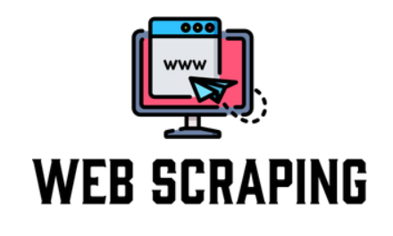

<h1 align="center">Hola, soy Leonardo 👋</h1>

## Acerca de mí 😀

¡Hola! Soy Leonardo Castillo, un estudiante apasionado de la carrera de Desarrollo de Software con un enfoque en el Front-End. Actualmente, me encuentro en un emocionante viaje de aprendizaje y crecimiento en el mundo de la programación.

### Mis Conocimientos

- **Lenguajes**: Tengo experiencia en el uso de HTML y JavaScript para crear interfaces web interactivas y atractivas. Me encanta explorar las últimas tendencias y estándares en desarrollo web.

- **Bases de Datos**: He trabajado con SQL Server y tengo conocimientos en la gestión de bases de datos para respaldar aplicaciones web.

- **Control de Versiones**: Utilizo Git como herramienta principal para el control de versiones y colaboración en proyectos de desarrollo.

### Lo que Estoy Aprendiendo

- Estoy constantemente mejorando mis habilidades en Front-End, explorando bibliotecas y frameworks como React y Vue.js para crear experiencias web más dinámicas.

- También me interesa el diseño de interfaces y la usabilidad, y estoy estudiando principios de UX/UI para mejorar la calidad de mis proyectos.

### Cómo Contactarme

Estoy emocionado por la oportunidad de aprender y colaborar en proyectos interesantes. Si tienes alguna pregunta, sugerencia o simplemente deseas conectarte conmigo, no dudes en enviarme un mensaje a través de [mi correo electrónico] o encontrarme en [LinkedIn](https://www.linkedin.com/in/tu-nombre).

¡Gracias por visitar mi perfil de GitHub!

## Proyectos *bombitas*
<table>
<tr>
<td width="50%">
<h3 align="center">WebScraping</h3>

</a>

Aprende a programar aplicaciones <strong>Android con Kotlin desde cero</strong> - En este curso aprenderás todo lo necesario ya que no es necesario ningún conocimiento previo. Curso <strong>GRATUITO de 12 horas</strong> con todo el código disponible para descargar.

                                                                                      
</td>

<td width="50%">
                
<h3 align="center">SGE</h3>

                                       

 

</a>

</a>

Las arquitecturas son <strong>IMPRESCINDIBLES</strong> para poder trabajar como desarrollador/a Android. En este curso, divido por ramas irás aprendiendo a implementar una arquitectura real y robusta con inyección de dependencias, clean architecture, testing y mucho más.

                                                             
</table>                                                                                 

 

### ⚙️ &nbsp;GitHub Analytics

